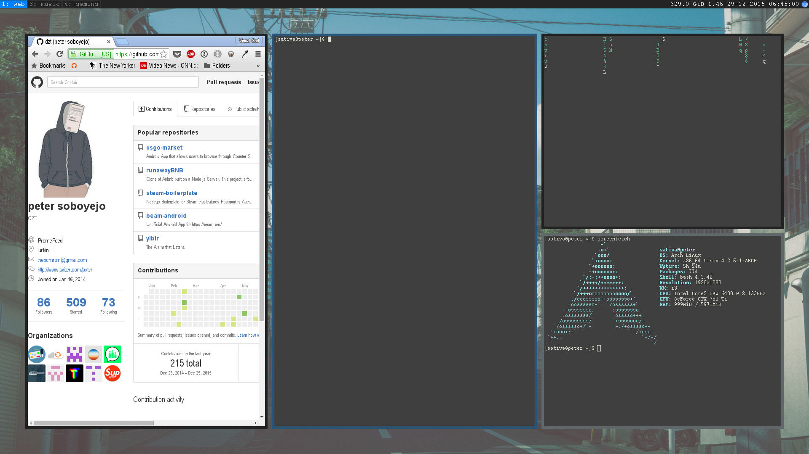

# Peter's Dotfiles

### Screens are outdated

<!--- My Setup {{{ -->

# My Setup

* Linux Distro: [Arch Linux](https://www.archlinux.org/)
* Window Manager: i3-gaps
* Launcher: [Rofi](https://davedavenport.github.io/rofi/)
* Terminal Emulator: [Termite](https://wiki.archlinux.org/index.php/Termite)
* Text Editor: [Vim](https://github.com/neovim/neovim)
* Music Player: [Mpd](http://www.musicpd.org/) + [ncmpcpp](http://ncmpcpp.rybczak.net/)
* Browser: Chromium
<!--- }}} -->

